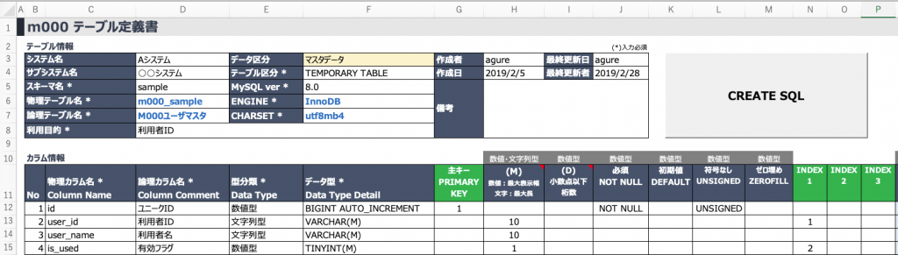
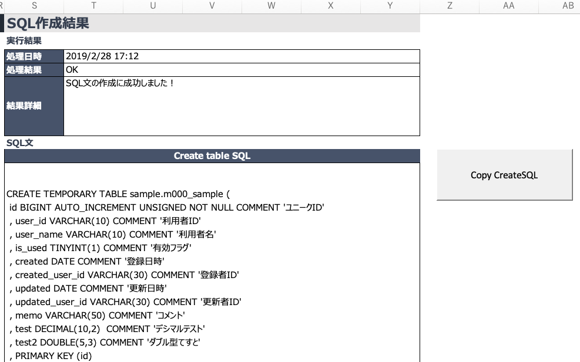

# MySQLテーブル設計＆定義書作成用ツール（ExcelVBA）

 (Win/Mac開発者支援) MySQLテーブル設計＆定義書作成用ツール　

MySQLでDB設計していたときに

- テーブル設計しながら簡単にテーブル定義書を作成したい
- テーブル定義書から自動でSQL文を生成することで楽したい
- SQL文の文法チェック的な機能があれば便利だ！

と思い立って作ったものです。

**目次**
<!-- vscode-markdown-toc -->
 1. [動作環境](#1)
 2. [機能仕様](#2)
 3. [入手方法](#3)
 4. [使い方](#4)
 5. [よくあるご質問（FAQ）](#5)
 6. [更新履歴](#6)
 <!-- 7. [残対応](#7) -->

<!-- vscode-markdown-toc-config
	numbering=true
	autoSave=true
	/vscode-markdown-toc-config -->
<!-- /vscode-markdown-toc -->
 

##  1. 動作環境

|対象OS|前提条件|備考|
|--|--|--|
|Windows|Excelがインストール済みであること||
|Mac|Excelがインストール済みであること||
※仕様上、Excelのバージョンは関係なく動作する見込みです

##  2. 機能仕様

|機能|説明|備考|
|--|--|--|
|テーブル設計入力|1つのワークシートにテーブル1件を記入||
|SQLの自動生成|入力した設計書をもとにSQL文を自動で作成 （型など簡易入力チェック機能あり）||
|SQL文のコピー|作成したSQL文をクリップボードへコピー||

##  3. 入手方法

1. ツール本体「MySQLテーブル定義ツール_v1.0.0.xlsm」をダウンロードします。
2. デスクトップなど自分のわかりやすい位置に配置します。

<!-- 

 -->

##  4. 使い方

1. 「Template」シートをコピーしてシート名を追加します。 シート名は任意の名前で構いませんので、わかりやすいようにつけてください。
1. テーブル情報とカラム情報を入力します。入力後、「CREATE SQL」ボタンをクリックします。

1. SQLの作成に成功すると、同じシート内の表示位置が移動し、以下のような結果が表示されますので、「Copy CreateSQL」ボタンをクリックしてSQL文をコピーし、MySQL側に貼り付けてご利用ください。

##  5. よくあるご質問（FAQ）

> データ型は全て対応していますか

基本的なものはひと通り対応しています。ただし、一部対応していないものがあります。ツール内の「型」シートで対象に「○」がついているもののみ利用可能となっています。

> 制約事項はありますか

ツール内の「仕様」シートにまとめてありますので、そちらをご覧ください。

> 動かないもしくは追加要望があります

ご要望については別途ページを作成中ですので、しばらくお待ちください。

##  6. 更新履歴
|バージョン|更新日|更新内容|更新者|
|--|--|--|--|
|1.0.0.0|2019/05/11|初版公開|Agure|
